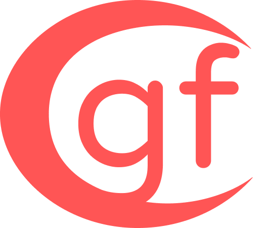

<div align="center">
  


# GF - Graphics Framework

</div>

<div align="center">
  


</div>

## Introduction:

This is **gf** - graphics framework for GNU/Linux and Windows OpenGL programming.
It's incredibly tiny, simple yet powerful codebase allows you to not only develop efficient native graphical application,
but also to sharpen your knowledge with low - level windowing and graphics, thanks to compact and commented code!

The main philosophy of this project is quite simple: *I wanted to learn how to make decent windowing library, focusing on speed and simplicity.* <br>
**gf** borrows concept from most popular and battle-tested libraries out there: SDL3, glfw, RGFW, raylib to name a few.

**gf** relies entirely on local dependencies of your operating system. As a USER you don't need to download any external dependency other than core development tools.

I hope you'll have lot's of fun using **gf**!

*NOTE:* <br>
*For the current state of the project, **gf** only supports **GNU/LINUX** operating system with X11 as a windowing server. In the future I plan to add support for Wayland, Win32 API and potentialy MacOS support.*

## Building:
<details>
<summary><h3>GNU/Linux:</h3></summary>

*NOTE:* <br>
*This building steps are described for Debian-based distributions of GNU/Linux. If you're using something different, search for different packages in your package manager.*

#### 1. Download dependencies:

```console
$ sudo apt install build-essential -y
$ sudo apt install git -y
```
#### 2. Clone this repository:

```console
$ git clone https://github.com/itsYakub/gf.git
$ cd ./gf/
```
#### 3. Build the project using GNU Make:

```console
$ make all
```

#### 4. Run one of demo program supplied with the repository:

```console
$ gcc ./demo/00-hello-world.c -L. -lgf -lEGL -lGL -lX11
```

</details>
<details>
<summary><h3>Windows:</h3></summary>
  
*NOTE:* <br>
*As of now, **gf** doesn't support Windows platform.*

</details>
<details>
<summary><h3>MacOS:</h3></summary>

*NOTE:* <br>
*As of now, **gf** doesn't support MacOS platform.*

</details>

## TODO:

<details>
<summary><h3>X11</h3></summary>

- [ ] Extend the window configuration;
- [ ] Select window icon at runtime (if that's even a good idea???);
- [ ] Functions for getting the addressess of Display, Context and an ID of the window (if that can be multi - platform);

</details>
<details>
<summary><h3>Wayland</h3></summary>

- [ ] Implement Wayland backend;

</details>
<details>
<summary><h3>Win32</h3></summary>

- [ ] Implement Win32 backend;

</details>

<details>
<summary><h3>MacOS</h3></summary>

- [ ] Implement MacOS backend;

</details>

## Licence:

This project is under the [LGPL-3.0 license](./LICENCE).
